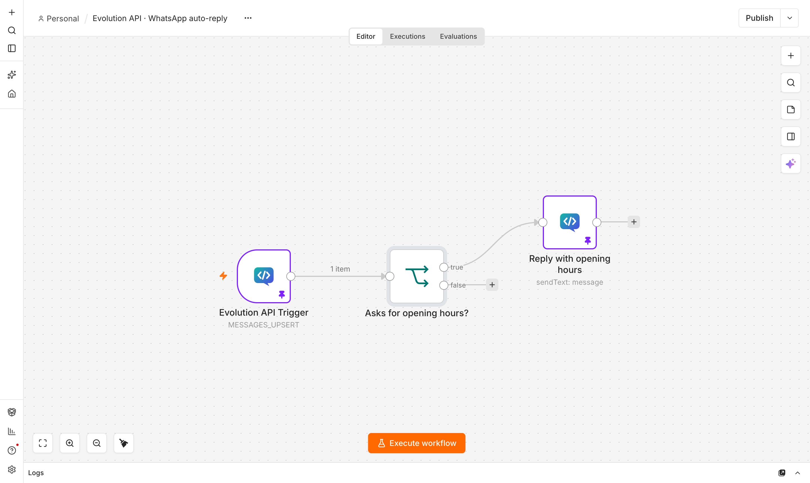
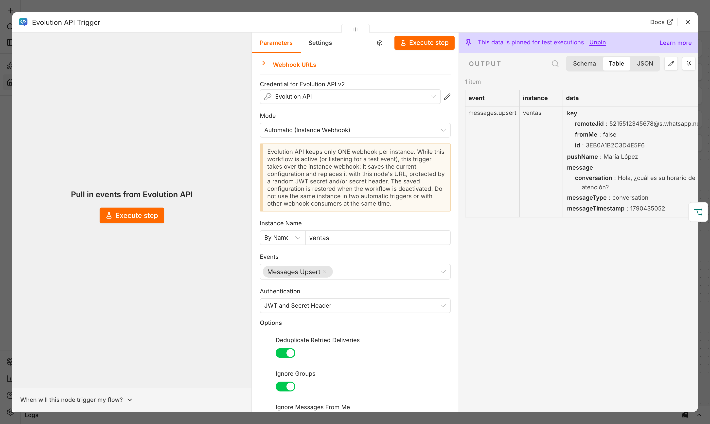
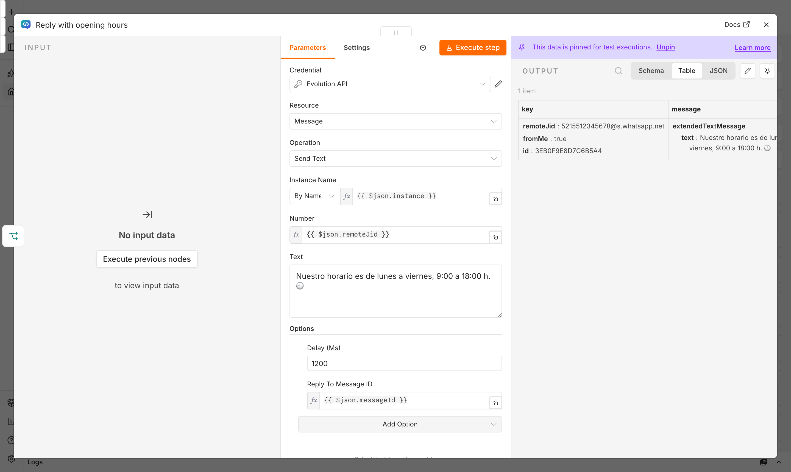
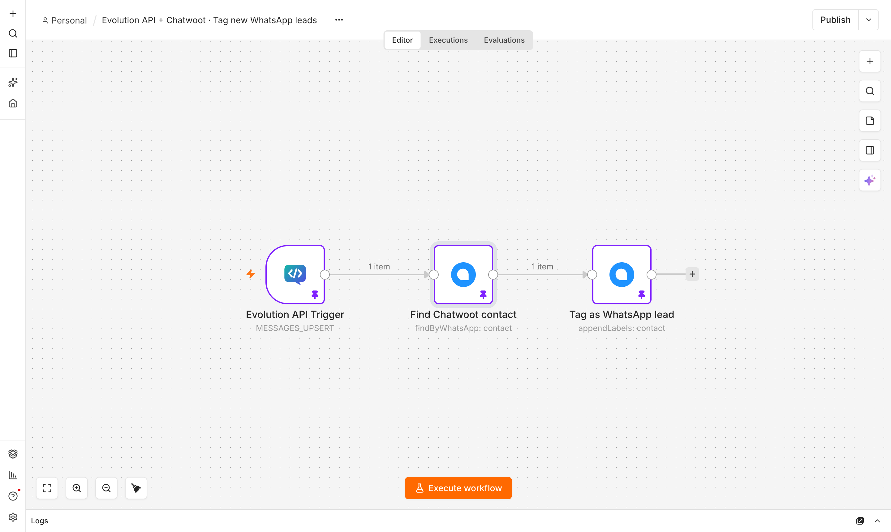

# n8n-nodes-evolution-api

n8n community node for **[Evolution API](https://github.com/EvolutionAPI/evolution-api) v2**
(WhatsApp): instances, messages, chats, groups, profiles, labels, webhooks, and the Chatwoot and
chatbot (Typebot, OpenAI, Dify, Flowise, EvoAI, Evolution Bot) integrations, plus a webhook
trigger. 13 resources, 101 operations, zero runtime dependencies, usable as an AI Agent tool.

> Resumen en español: nodo comunitario de n8n para **Evolution API v2** (WhatsApp) — 13 recursos
> (instancias, mensajes, chats, grupos, perfiles, etiquetas, webhooks, Chatwoot, chatbots) y un
> nodo Trigger para recibir eventos por webhook (modo automático con toma del webhook de la
> instancia, o manual). Sin dependencias en tiempo de ejecución; usable como herramienta de un AI
> Agent. Compatible con Evolution API 2.3.7 y 2.4.0-rc2 (2.4 requiere activar la licencia del
> servidor). Instalación, credenciales y todas las secciones de abajo están en inglés; usa el
> traductor de tu navegador si lo necesitas.

- [Screenshots and examples](#screenshots-and-examples)
- [Installation](#installation)
- [Credentials: "Evolution API v2"](#credentials-evolution-api-v2)
- [Resources and operations](#resources-and-operations)
- [Evolution API 2.4 license gate](#evolution-api-24-license-gate)
- [Trigger: setup and security](#trigger-setup-and-security)
- [Using with Chatwoot](#using-with-chatwoot)
- [AI Agent tool usage](#ai-agent-tool-usage)
- [Behavior notes](#behavior-notes)
- [Compatibility](#compatibility)
- [Development](#development)
- [Release process](#release-process)

## Screenshots and examples

Taken in n8n 2.40.7 with the example workflows in [`examples/workflows`](examples/workflows) (sample data is fictional and pinned, so you can open them without an Evolution API server). Import a file with **Workflows → Import from File**, then select your own credentials.

| File | What it does |
|---|---|
| [`whatsapp-auto-reply.json`](examples/workflows/whatsapp-auto-reply.json) | Evolution API Trigger (automatic mode, own messages and groups ignored) → IF the customer asks for opening hours → reply quoting their message |
| [`tag-whatsapp-leads-in-chatwoot.json`](examples/workflows/tag-whatsapp-leads-in-chatwoot.json) | New WhatsApp message → find the Chatwoot contact by WhatsApp number (needs [`@renatoascencio/n8n-nodes-chatwoot`](https://www.npmjs.com/package/@renatoascencio/n8n-nodes-chatwoot)) → add the `whatsapp-lead` label |



| Trigger in automatic mode (JWT + secret header) | Message › Send Text |
|---|---|
|  |  |

**Evolution API + Chatwoot:**



## Installation

In n8n: **Settings → Community Nodes → Install** and enter
`@renatoascencio/n8n-nodes-evolution-api`. On a self-hosted instance you can also add it to your
`N8N_CUSTOM_EXTENSIONS` image or run `npm install @renatoascencio/n8n-nodes-evolution-api` in your
n8n installation's custom-nodes directory.

**n8n 2.x**: community nodes install normally (unverified packages are allowed by default).

**n8n 3.0** (scheduled October 2026) turns unverified community packages off by default
(`N8N_UNVERIFIED_PACKAGES_ENABLED` changes from `true` to `false`). Until this package is verified
by n8n, set `N8N_UNVERIFIED_PACKAGES_ENABLED=true` on self-hosted n8n 3.0+ instances to keep
installing and using it.

The credential type is internally named `evolutionWhatsAppApi`, not `evolutionApi`,
`evolutionApiApi` or `evolutionApiV2Api` (already used by other community packages for Evolution
API). Because n8n credential type names are global per instance, this lets you install this
package **alongside** another Evolution API community node without either one breaking the
other's saved credentials.

## Credentials: "Evolution API v2"

| Field | Description |
|---|---|
| Base URL | Your Evolution server, e.g. `https://evolution.example.com` (the address that answers `GET /` with the version), no trailing slash. |
| API Key | Either the **global key** (`AUTHENTICATION_API_KEY`) or **one instance's token** (the `hash` value Evolution returns from Instance → Create). A global key can act on every instance and is required for Instance → Create and (usually) Instance → Get Many; an instance token only works for that one instance. |
| Default Instance Name | Optional. Used whenever a node's *Instance Name* field is left empty. Recommended when the API Key is an instance token, since the credential test then checks that specific instance. |

The credential test calls `GET /instance/connectionState/<Default Instance>` when a default
instance is set (works with both key types), or `GET /instance/fetchInstances` otherwise (global
key, or an instance token when the server has `DATABASE_SAVE_DATA_INSTANCE=true`). It reports a
`503` as the Evolution 2.4 license gate, a `401` as an invalid key, and a `404` as a wrong Base URL
or Default Instance Name.

Evolution API does not treat an instance token as a hard tenant boundary: on 2.3.7 and 2.4.0-rc2 a
request can override which instance it targets via a query parameter, using *any* valid token.
This node never forwards arbitrary query parameters itself, but don't rely on instance tokens as
your only isolation between tenants on those server versions.

## Resources and operations

Generated from the node's own operation descriptions (13 resources, 101 operations).

### Instance (8)

| Operation | What it does |
|---|---|
| Connect | Start the WhatsApp session and get a QR code or pairing code |
| Create | Create a new instance (requires the global API key) |
| Delete | Delete an instance, logging it out first when connected |
| Get Connection State | Get the connection state of an instance (open, connecting or close) |
| Get Many | List instances with their settings and integrations |
| Logout | Log out the WhatsApp session but keep the instance |
| Restart | Restart the connection of a connected instance |
| Set Presence | Set the global presence of the account (WhatsApp Baileys only) |

### Message (15)

| Operation | What it does |
|---|---|
| Send Text | Send a text message, optionally as a reply or with mentions |
| Send Media | Send an image, video, document or audio file from a URL, base64 or binary file, with an optional caption |
| Send Audio | Send a voice note (push-to-talk) from a URL, base64 or binary file; converted to OGG/Opus by Evolution |
| Send Video Note | Send a round video note (PTV) from an MP4 URL, base64 or binary file (Baileys only) |
| Send Status | Post a text, image, video or audio status (story) to selected contacts (Baileys only) |
| Send Sticker | Send an image as a sticker; Evolution converts it to WebP (Baileys only) |
| Send Location | Send a map location with a name and an address |
| Send Contact | Send one or more contact cards (vCards) |
| Send Reaction | React to a message with an emoji, or remove a reaction |
| Send Poll | Send a poll with 2-10 options (Baileys only) |
| Send List | Send a message with a button that opens a list of selectable rows |
| Send Buttons | Send a message with quick reply, URL, call, copy code or PIX buttons |
| Send Carousel *(2.4+)* | Send a carousel of 1-10 cards with image, text and buttons (Baileys only) |
| Send Template | Send an approved WhatsApp Business template (Cloud API instances only) |
| Generate Message ID *(2.4+)* | Generate a valid WhatsApp message ID for the Custom Message ID option, e.g. for retries without duplicates (Baileys only) |

### Chat (17)

| Operation | What it does |
|---|---|
| Check Numbers | Check whether phone numbers have WhatsApp and get their JIDs (one item per number) |
| Get | Get a chat stored by Evolution (name, labels, unread count) |
| Get Many | Get many chats with their last message and unread count, newest first |
| Get Contacts | Get contacts stored by Evolution, optionally filtered by JID or push name |
| Get Messages | Get messages stored by Evolution, newest first, filtered by chat, ID, type or date |
| Get Status Updates | Get delivery/read receipts of messages (sent, delivered, read, played) |
| Get Poll Votes *(2.4+)* | Get the results and voters of a poll |
| Get Channels *(2.4+)* | Get the WhatsApp channels (newsletters) with stored messages |
| Download Media | Download the media of a message as a binary file |
| Edit Message | Edit the text or caption of a message sent by this instance |
| Delete Message for Everyone | Delete (revoke) a sent message for everyone in the chat |
| Mark as Read | Send read receipts (blue ticks) for messages |
| Mark as Played *(2.4+)* | Send the "played" receipt (blue microphone) for voice messages |
| Mark as Unread | Mark a whole chat as unread |
| Archive | Archive or unarchive a chat |
| Send Presence | Show "typing…" or "recording audio…" in a chat for a while |
| Update Block Status | Block or unblock a contact |

### Group (17)

| Operation | What it does |
|---|---|
| Create | Create a group with a subject and initial participants |
| Get | Get the details of a group by JID, including its participants |
| Get Many | Get the groups the instance belongs to, one item per group |
| Get Participants | Get the participants of a group and their admin role |
| Update Subject / Description / Picture / Setting | Change a group's name, description, picture, or who can send/edit |
| Update Member Add Mode *(2.4+)* | Choose whether only admins or all members can add participants |
| Update Participants | Add, remove, promote or demote participants |
| Toggle Ephemeral | Turn disappearing messages on (24h/7d/90d) or off |
| Get / Revoke Invite Code | Get or invalidate a group's invite link |
| Get Invite Info | Preview a group from an invite code, without joining |
| Accept Invite | Join a group with an invite code or link |
| Send Invite | Send a group's invite link to one or more numbers |
| Leave | Make the instance leave a group |

### Profile (9)

Get, Get Business Profile, Get Picture, Get Privacy Settings, Remove Picture, Update Name, Update
Picture, Update Privacy Settings, Update Status — of a contact, group, or the instance's own
WhatsApp account.

### Chatbot (15)

Create, Get, Get Many, Update, Delete, Change Session Status, Get Sessions, Ignore JID, Get/Set
Settings — for the n8n, Typebot, OpenAI, Dify, Flowise, EvoAI and Evolution Bot integrations of an
instance, plus Start Typebot, and Create/Delete/Get OpenAI Credential and Get OpenAI Models for
the OpenAI integration.

### Chatwoot (2), Settings (2), Proxy (2), Webhook (4)

- **Chatwoot**: Get / Set the Chatwoot integration of an instance.
- **Settings**: Get / Set instance behavior (reject calls, ignore groups, always online, read
  receipts…).
- **Proxy**: Get / Set the proxy of an instance (Evolution tests it before saving).
- **Webhook**: Get / Set the instance webhook, and Get Transport / Set Transport for the
  WebSocket, RabbitMQ, Amazon SQS, NATS, Kafka or Pusher event transports.

**Set/Setting operations read the current configuration first and merge in only the fields you
add**, because Evolution's `settings/set`, `chatwoot/set`, `proxy/set` and
`chat/updatePrivacySettings` all require the complete object on every write — the node reads it,
merges your changes, and writes the full object back so unrelated fields aren't reset.

### Label (3)

Add to Chat, Get Many, Remove from Chat — WhatsApp Business labels.

### Template (6)

Create, Update, Delete, Get Many, Get Catalog, Get Catalog Collections — WhatsApp Cloud API
message templates and (Baileys) the WhatsApp Business product catalog.

### Call (1)

Offer — **experimental / no-op**: on both Evolution API 2.3.x and 2.4.x this route returns a
placeholder call ID and places no actual call (the upstream Baileys call code is commented out).
Included for completeness, not as a working feature.

## Evolution API 2.4 license gate

Evolution API 2.4 answers **HTTP 503 with `code: "LICENSE_REQUIRED"` on every route** until the
server itself is activated (this also blocks its inbound webhook receivers, e.g. for Chatwoot).
This node turns that into a clear, **never retried** error: *"Evolution API license not activated
(503 LICENSE_REQUIRED). Activate it at `<register_url>`"*. Activate the server at
`<Base URL>/manager/login`, and confirm with `GET <Base URL>/license/status` before relying on it
in production. Operations and fields that only exist on Evolution 2.4+ (see the tables above) are
marked "Requires Evolution API 2.4+" in the node UI; calling one against a 2.3.7 server surfaces
Evolution's own 404 instead.

## Trigger: setup and security

The **Evolution API Trigger** node starts a workflow for each webhook event Evolution sends.

- **Automatic mode** (default): on activation, the trigger registers this workflow's URL as the
  target instance's webhook (`POST /webhook/set`), protected with a random secret it generates
  (an HS256 JWT `jwt_key`, a secret header, or both). On deactivation it restores the webhook
  configuration that was there before (or disables the webhook if there was none), including after
  an n8n restart.

  > ⚠️ **Evolution API keeps only ONE webhook per instance.** While an automatic-mode trigger is
  > active (or listening for a test event), it takes over that instance's webhook entirely. Do
  > not point two automatic triggers, or an automatic trigger and some other webhook consumer, at
  > the same instance at the same time — whichever one activates last wins the instance's single
  > webhook slot.

- **Manual mode**: you configure Evolution yourself (the instance webhook, or the global
  `WEBHOOK_GLOBAL_URL`) with "Webhook by Events" off and this node's URL, and the trigger only
  verifies and parses incoming deliveries.

  > ⚠️ **The global webhook (`WEBHOOK_GLOBAL_URL`) cannot be authenticated.** Evolution's global
  > webhook has no per-instance headers and cannot carry a `jwt_key`, so Manual mode's
  > Authentication must be set to "None" for it — the webhook URL itself is the only protection.
  > Treat that URL as a secret and/or restrict it at the network/reverse-proxy level. An instance
  > webhook, by contrast, can carry a secret header and/or a `jwt_key`, both of which this trigger
  > verifies.

Both modes support: filtering by event type, message type, instance name, and
group/newsletter/broadcast/"from me" origin; deduplicating retried deliveries (Evolution retries
an undelivered webhook up to 10 times, and an instance can have both an instance and a global
webhook firing for the same event); stripping the `apikey` field Evolution sometimes embeds in the
payload before it reaches your workflow data (there's an option to keep it, off by default); and
turning embedded media (when "Include Media as Base64" is on in the webhook config) into n8n
binary data.

## Using with Chatwoot

Configure the integration from the **Chatwoot** resource's **Set** operation (Account ID, API
Access Token, URL, Inbox Name, and the conversation/behavior toggles); it reads the current
configuration first and only changes the fields you add. Evolution's Chatwoot webhook
(`POST /chatwoot/webhook/:instanceName`) has **no authentication of its own** — protect it at your
reverse proxy (e.g. restrict it to Chatwoot's IP range) rather than relying on Evolution. Also
note that the Evolution 2.4 license gate (above) blocks that inbound webhook route too: until a
2.4 server is activated, Chatwoot agent replies stop reaching WhatsApp.

## AI Agent tool usage

The Evolution API node has `usableAsTool: true`: add it as a tool under an **AI Agent** node's
Tools list (or connect it to the Agent's Tool input) to let a model send messages, look up chats,
contacts or groups, manage labels, etc. Prefer operations with simple, flat parameters (Send Text,
Check Numbers, Get Many, Get Contacts…) for tool use; operations with nested structures (Send
List's sections/rows, Send Carousel's cards, Group → Update Participants) are harder for a model
to fill in correctly through the Agent's generated tool call and are better suited to a regular
workflow step. The **Evolution API Trigger** cannot be used as a tool (n8n doesn't support trigger
nodes as AI Agent tools).

## Behavior notes

- Every input item is processed independently, with `pairedItem` on the output and full *Continue
  On Fail* support (failed items come back as `{ error, description?, httpCode? }`).
- Errors surface Evolution's own message (`response.message`) plus a hint for the HTTP status.
  `429` is retried with backoff (honoring `Retry-After`); `502`/`503` are retried only for
  idempotent requests; `504` only for reads (Evolution may already have applied the write). Send
  operations are never retried on a 5xx, so messages are never duplicated. `503 LICENSE_REQUIRED`
  is never retried.
- Numbers such as `+52 1 (55) 1234-5678` are normalized using the same rules Evolution's own
  `createJid` applies (including the Mexico/Argentina/Brazil digit-count quirks); JIDs you already
  have (`@lid`, `@g.us`, `@s.whatsapp.net`, `@broadcast`, `@newsletter`) are passed through
  untouched, never rewritten.
- Instance names and other path IDs containing `.` or `..` are rejected instead of being encoded
  literally, which would otherwise let a value like `..` change which route the request hits.
- Instance → Get Many hides secrets (instance token, Chatwoot token, proxy password) unless
  *Include Secrets* is turned on, and returns no items when a filter matches no instance instead
  of failing.

## Compatibility

| Component | Versions |
|---|---|
| Evolution API | **2.3.7** (tested against its sources) and **2.4.0-rc2** (2.4-only features are marked in the UI, see above; 2.4 requires server license activation). `develop`/nightly builds are **not supported** — they change contract details from release to release (and had at least one release-blocking regression in instance creation at the time this node was built). **Evolution Go is not supported** (different API entirely). |
| n8n | 2.x (built and tested against `n8n-workflow` ~2.13); expected to keep working on n8n 3.0 once you enable unverified packages, see [Installation](#installation). |
| Node.js | 18+ |

## Development

```bash
npm install --ignore-scripts   # this package has no runtime deps and needs no native addon builds
npm run build                   # tsc, then copies icons and .node.json codex files into dist/
npm run lint                    # project ESLint rules (eslint:recommended, typescript-eslint, n8n-nodes-base)
npm run lint:n8n                # n8n community-node verification rules (@n8n/eslint-plugin-community-nodes)
npm test                        # Jest, full suite
```

`npm run lint:n8n` runs `@n8n/eslint-plugin-community-nodes`'s recommended rules through a
separate flat config (`eslint.n8n.config.mjs`), independent of the project's own `.eslintrc.js` /
`npm run lint`. CI (`.github/workflows/ci.yml`) runs `npm ci`, both lint scripts, the test suite
and the build on every push and pull request, across Node 18/20/22.

## Release process

Tagging a commit `vX.Y.Z` and pushing the tag runs `.github/workflows/publish.yml`, which installs
dependencies, runs the test suite, builds, and runs `npm publish --provenance --access public`
with `permissions: id-token: write` — the GitHub Actions + npm provenance setup n8n has required
for community-node verification since May 2026.

Publishing currently authenticates with an `NPM_TOKEN` repository secret (a classic npm automation
token), not npm Trusted Publishing (OIDC): Trusted Publishing can only be configured for a package
that already exists on the registry, and this package has not been published yet. After the first
release, a maintainer can switch to Trusted Publishing from the package's settings on npmjs.com
and remove the `NPM_TOKEN` secret; see the comments in `publish.yml` for the exact steps.

## License

[MIT](LICENSE)
